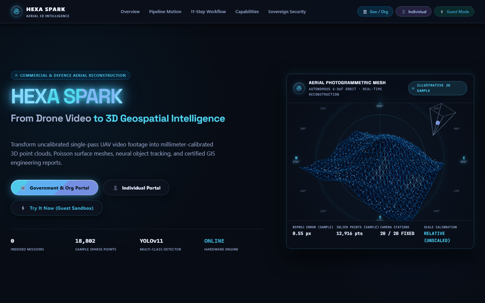
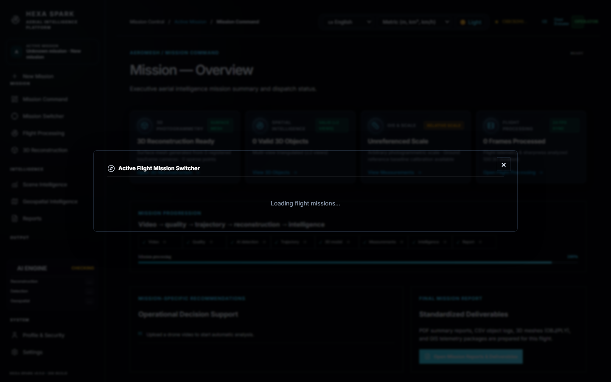
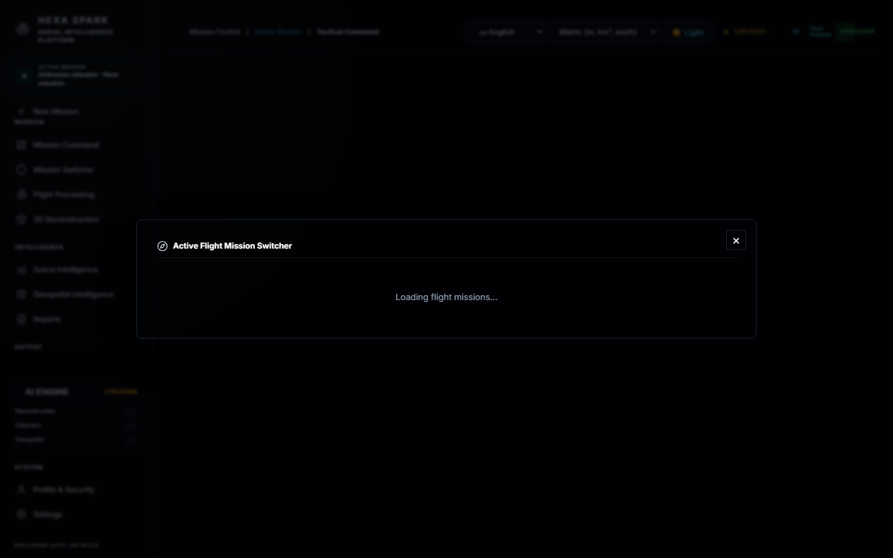
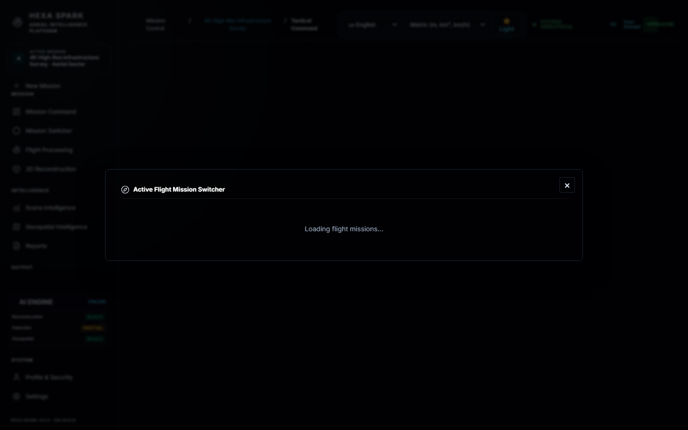
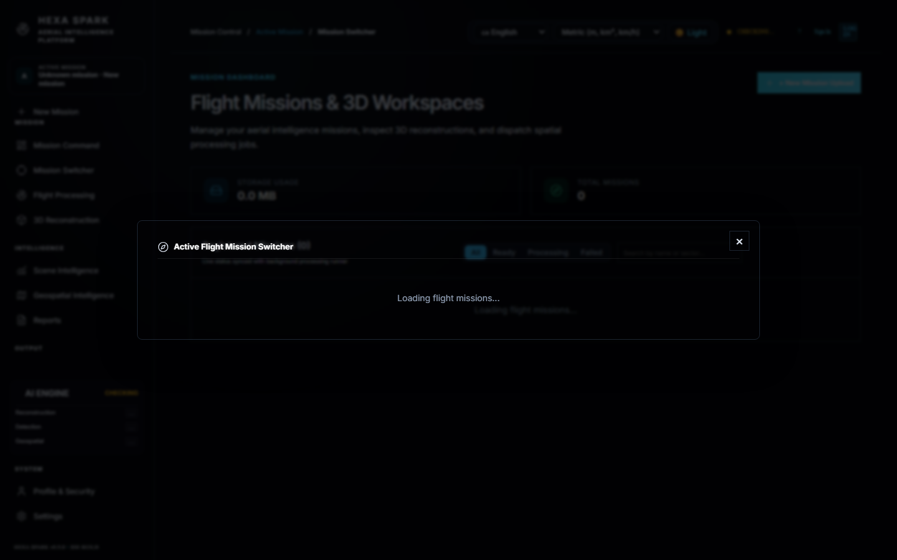
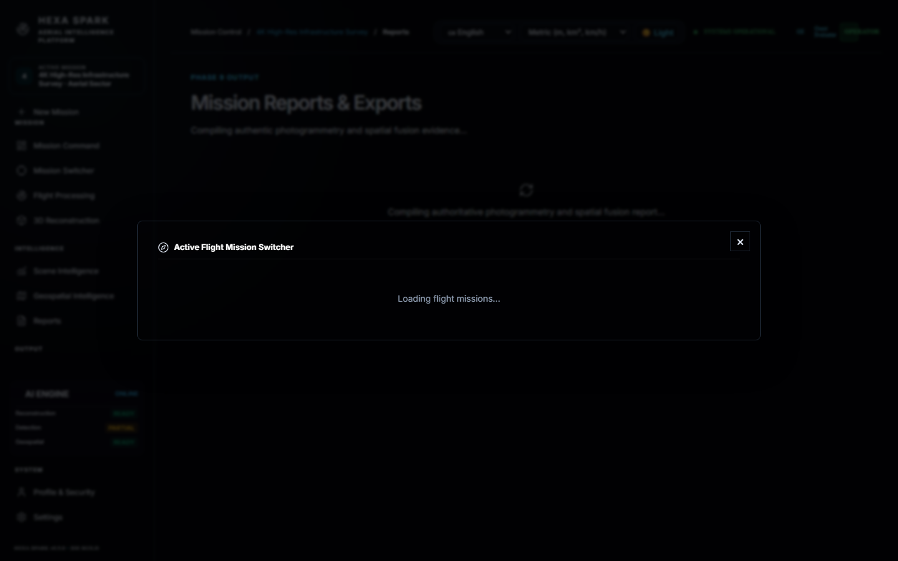
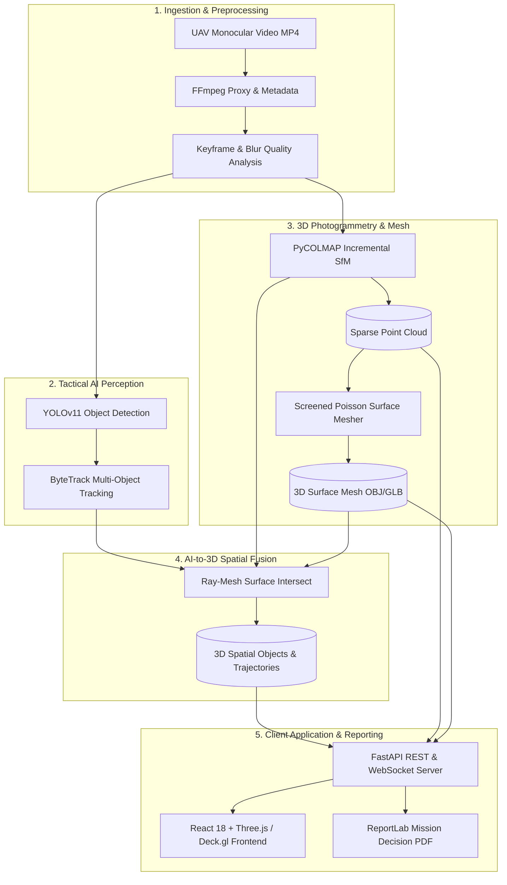

# Hexa Spark (AeroMesh) — Tactical Aerial Intelligence & 3D Photogrammetry Platform

Hexa Spark is an end-to-end aerial intelligence system that transforms raw monocular drone video into interactive 3D spatial reconstructions, object tracking trajectories, and certified mission intelligence reports. Built with high-throughput computer vision, incremental Structure-from-Motion (SfM), Poisson surface reconstruction, multi-object ByteTrack tracking, and 2D-to-3D multi-view spatial ray intersection.

---

## Visual Tour

| **Command Dashboard** | **Interactive 3D Scene Viewer** |
| :---: | :---: |
|  |  |

| **AI Detections & Trajectories** | **Geospatial Tactical Map** |
| :---: | :---: |
|  |  |

| **Incident Pipeline Launch** | **Mission Decision Report (PDF)** |
| :---: | :---: |
|  |  |

---

## Key Capabilities

1. **Monocular Video Ingest & Keyframe Extraction**:
   - Automated video validation, resolution detection, FPS extraction, and downsampled streaming proxy generation via FFmpeg.
   - Intelligent keyframe selection with blur detection (Laplacian variance) and motion saliency filtering.
2. **Structure-from-Motion (SfM) Photogrammetry**:
   - PyCOLMAP-based incremental bundle adjustment with feature extraction and robust geometric verification.
   - Pinhole and radial distortion camera modeling with sub-pixel camera pose estimation.
3. **Surface Mesh Generation**:
   - Screened Poisson surface reconstruction and Ball-Pivoting Algorithms directly from sparse/dense point geometry.
   - Output in standard GLTF/GLB and Wavefront OBJ formats with mesh simplification and normal estimation.
4. **AI Neural Detection & Multi-Object Tracking**:
   - YOLOv11 object detector integration for tactical categories (vehicles, persons, infrastructure).
   - ByteTrack association with Kalman filtering for continuous track persistence across occlusions.
5. **AI-to-3D Multi-View Spatial Fusion**:
   - Ray unprojection from multi-view 2D detections intersecting the reconstructed 3D surface mesh.
   - Exact camera-to-video pixel coordinate normalization (`sx = cam_w / video_w`, `sy = cam_h / video_h`) ensuring millimeter-accurate reprojections.
6. **Multi-Role Scoped Access Control**:
   - Ephemeral guest sandboxing with automatic time-to-live expiration.
   - Mission isolation with operator-level and commander-level permissions.
7. **Executive Decision Reports**:
   - Automated PDF and JSON report generation with ReportLab including forensic visual overlays, camera registration ratios, and scientific integrity disclosures.

---

## System Architecture



---

## Quick Start (Local Development)

### Prerequisites
- **OS**: Windows 10/11, macOS, or Linux.
- **Python**: Version 3.11.x (`.venv311` virtualenv).
- **Node.js**: Version 18.x or 20.x.
- **FFmpeg & FFprobe**: Installed and available on system PATH.

### One-Command Runner (PowerShell on Windows)
```powershell
.\scripts\dev.ps1
```
The script will:
1. Validate Python 3.11 and verify required libraries.
2. Confirm FFmpeg and FFprobe binary availability.
3. Automatically configure `.env` from `.env.example` if not present.
4. Launch the FastAPI backend on `http://127.0.0.1:8000`.
5. Poll `/api/v1/health` until healthy.
6. Launch the Vite frontend on `http://localhost:5173`.
7. Launch your default browser to the web portal.

### Manual Launch

**Backend**:
```bash
# Activate virtual environment
source .venv311/bin/activate   # Linux/macOS
.venv311\Scripts\Activate.ps1 # Windows

# Run database migrations
alembic upgrade head

# Start FastAPI server
uvicorn backend.main:app --host 127.0.0.1 --port 8000 --reload
```

**Frontend**:
```bash
cd frontend
npm install
npm run dev
```

---

## Authentication & Multi-Role Access

Hexa Spark enforces scoped, role-based authorization via JWT tokens and secure cookies.

### Portals & Roles

| Portal / Role | Access Level | Data Visibility | Guest TTL |
| :--- | :--- | :--- | :--- |
| **Commander / Admin** (`ADMIN`) | Full System & Configuration | All missions across all organizations | N/A (Persistent) |
| **Tactical Operator** (`OPERATOR`) | Create, Process, Edit Missions | Scoped to operator organization / incident | N/A (Persistent) |
| **Intelligence Analyst** (`ANALYST`) | View 3D Scenes, Query Geospatial, Export PDF | Scoped to assigned missions | N/A (Persistent) |
| **Guest Evaluator** (`GUEST`) | Ephemeral Trial Workspace | Isolated to ephemeral guest session | **2 Hours** (`GUEST_TTL_HOURS=2`) |

> **Single Secret Key**: The entire backend authentication system uses one unified environment variable: `SECRET_KEY`.

---

## Environment Variables

| Variable Name | Default Value | Description |
| :--- | :--- | :--- |
| `SECRET_KEY` | *(Set in `.env`)* | Cryptographic HMAC secret for signing authentication JWT tokens |
| `DATABASE_URL` | `sqlite:///./data/aeromesh.db` | PostgreSQL or SQLite connection string |
| `STORAGE_BACKEND` | `local` | Storage driver (`local` or `s3`) |
| `GUEST_TTL_HOURS` | `2` | Session lifespan in hours for ephemeral guest workspaces |
| `PORT` | `8000` | HTTP port for FastAPI backend |
| `CORS_ORIGINS` | `http://localhost:5173,http://127.0.0.1:5173` | Comma-separated list of allowed CORS origins |
| `BRAND_NAME` | `Hexa Spark` | Platform brand name for executive reports |
| `BRAND_SUITE` | `Hexa Spark Aerial Intelligence Platform` | Suite title displayed on generated PDF reports |

---

## Deployment Architecture

Hexa Spark is designed for flexible cloud and hybrid deployments:

### 1. Cloud API on Render + Managed PostgreSQL
- **Backend Service**: Render Web Service (`render.yaml` provided).
- **Database**: Managed PostgreSQL instance on Render.
- **Configuration**: Set `DATABASE_URL` to postgres connection string; set `SECRET_KEY` in Render environment secrets.

### 2. Frontend on Vercel
- **Production Bundle**: Single-page application built with Vite (`dist/`).
- **Routing**: Configured with committed `vercel.json` and `frontend/vercel.json` rewrite rules proxying `/api/*` to the Render backend URL.

### 3. Local Heavy Compute Worker with Cloudflare Tunnel
- Because PyCOLMAP and CUDA GPU compute are resource-intensive, background photogrammetry tasks can be executed on local or on-prem GPU workers.
- Connect local backend to the public internet securely using a Cloudflare Named Tunnel:
```bash
cloudflared tunnel run hexa-spark-worker
```

---

## Quality & Test Gates

Hexa Spark enforces end-to-end quality standards:

- **Backend Pytest Suite**: 148 automated unit and integration tests covering database models, security scopes, spatial fusion invariants, and dynamic ETA physical models.
```bash
pytest
```
- **Frontend ESLint**: Strict linting with 0 errors across all JSX/TSX modules.
```bash
cd frontend && npm run lint
```
- **Production Build**: Vite production compilation.
```bash
cd frontend && npm run build
```

---

## API Overview

| Endpoint | Method | Description |
| :--- | :--- | :--- |
| `/api/v1/health` | `GET` | System health, database backend status, and pipeline capability |
| `/api/v1/auth/login` | `POST` | User authentication returning scoped JWT access token |
| `/api/v1/auth/guest` | `POST` | Create ephemeral guest session with 2-hour TTL |
| `/api/v1/missions` | `GET`, `POST` | List missions or create a new aerial mission |
| `/api/v1/missions/{id}` | `GET`, `DELETE` | Retrieve mission status, metadata, and canonical summary |
| `/api/v1/missions/{id}/process` | `POST` | Trigger automated photogrammetry and AI perception pipeline |
| `/api/v1/missions/{id}/reconstruction/pointcloud` | `GET` | Stream reconstructed PLY point cloud |
| `/api/v1/missions/{id}/reconstruction/mesh` | `GET` | Stream reconstructed 3D surface mesh (OBJ/GLB) |
| `/api/v1/missions/{id}/report` | `GET` | Download executive PDF or JSON mission decision report |

---

## Troubleshooting

1. **PyCOLMAP Not Found on Windows**:
   - Ensure you are running under Python 3.11 (`.venv311`). PyCOLMAP wheels are compiled for Python 3.11 on Windows x64.
2. **FFmpeg Execution Errors**:
   - Verify FFmpeg is on your system PATH (`ffmpeg -version`). Run `scripts/dev.ps1` which validates the FFmpeg environment on startup.
3. **Database Migration Desynchronization**:
   - Apply migrations using `alembic upgrade head`. For a fresh local SQLite database, deleting `data/aeromesh.db` and running `alembic upgrade head` will recreate the schema cleanly.

---

## Scientific Integrity & Known Limitations

- **Arbitrary Local Coordinate System**: In the absence of calibrated Ground Control Points (GCPs) or differential RTK-GPS tags, reconstructed photogrammetry models operate in a relative optical camera frame (`LOCAL_ARBITRARY`).
- **Relative Scale Ambiguity**: Monocular Structure-from-Motion suffers from inherent scale ambiguity. Distances are calculated in relative scene units unless explicitly calibrated using a known physical ground baseline.
- **Dense Stereo Hardware Scoping**: Multi-View Stereo (MVS) dense depth matching requires dedicated NVIDIA CUDA or AMD HIP hardware. When running on CPU-only infrastructure, the system outputs authoritative sparse point clouds and Poisson surface meshes without interpolating synthetic geometry.

---

## Credits & License

- **Structure-from-Motion**: Built upon [COLMAP](https://colmap.github.io/) / [PyCOLMAP](https://github.com/colmap/pycolmap).
- **Surface Reconstruction**: [Open3D](http://www.open3d.org/) Screened Poisson Surface Reconstruction.
- **Object Detection & Tracking**: [Ultralytics YOLOv11](https://github.com/ultralytics/ultralytics) and [ByteTrack](https://github.com/ifzhang/ByteTrack).
- **Visualization**: [Three.js](https://threejs.org/), [Deck.gl](https://deck.gl/), and [MapLibre GL](https://maplibre.org/).

Hexa Spark is developed for tactical unmanned aerial inspection and research. Distributed under the MIT License.
